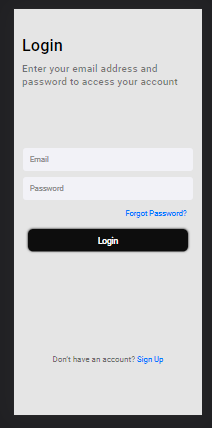

#  💜 APPLICATION LOGIN SCREEN 

#  ⁉ Project's goal!
---

  The goal is to put into <strong>practice the challenge </strong> of the programming course I take.
In this project we explore the properties of css and html replicating a login screen made in figma!
  

  <a href="https://www.figma.com/file/6XBh5bikhVuvNrIu8JHGie/Projeto-CodeClub"> <strong> 🟣 Figma Project Link </strong> </a>
